# KQC7016 Assignment 2: Smart Hospital Data Analytics

This repository contains the code, datasets, figures, and result files for **KQC7016 Data Analytics Assignment 2**.

## Project Title

**AI for Medicine: Smart Hospital**

## Team Members

* **NIE JING** — 25069019
* **DAI FENFANG** — 25069603

## Project Overview

This project applies data analytics methods to a smart hospital scenario. The aim is to support hospital operation efficiency, patient risk classification, healthcare service planning, and business intelligence decision-making.

The project is divided into two connected parts:

* **Part A:** Patient waiting time prediction and operation efficiency analysis
* **Part B:** Patient risk classification and service association analysis

The datasets used in this project are simulated smart hospital datasets. They were created for academic analysis and do not contain real patient records.

---

# Part A: Patient Waiting Time Prediction and Operation Efficiency

Part A focuses on predicting patient waiting time and identifying congestion patterns in a smart hospital.

## Objectives

* To analyse patient waiting time patterns.
* To predict patient waiting time using hospital operation variables.
* To group patients into low, medium, and high waiting-time patterns.
* To support queue management and staff allocation.

## Dataset

The Part A dataset contains **500 simulated patient records**. The main variables include:

* Patient_ID
* Age
* Gender
* Department
* Arrival_Hour
* Day_Type
* Queue_Length
* Staff_Available
* Consultation_Time
* Waiting_Time
* Satisfaction_Score

The target variable is:

* **Waiting_Time**

## Methods Used

* Multiple Linear Regression
* K-Means Clustering

## Main Files

* `PartA_WaitingTime_Analysis.ipynb`
* `smart_hospital_waiting_time.xls`
* `smart_hospital_waiting_time_with_clusters.xls`
* `fig1_waiting_time_distribution.png`
* `fig2_waiting_time_by_department.png`
* `fig3_queue_vs_waiting_time.png`
* `fig4_staff_vs_waiting_time.png`
* `fig5_actual_vs_predicted_waiting_time.png`
* `fig6_patient_clusters.png`

## Main Results

The multiple linear regression model achieved:

* **MSE = 65.39**
* **RMSE = 8.09 minutes**
* **R² = 0.878**

The K-Means clustering model identified three waiting-time groups:

* **Cluster 0:** High waiting-time group
* **Cluster 1:** Low waiting-time group
* **Cluster 2:** Medium waiting-time group

## Part A Result Figures

### Figure 1. Distribution of Patient Waiting Time

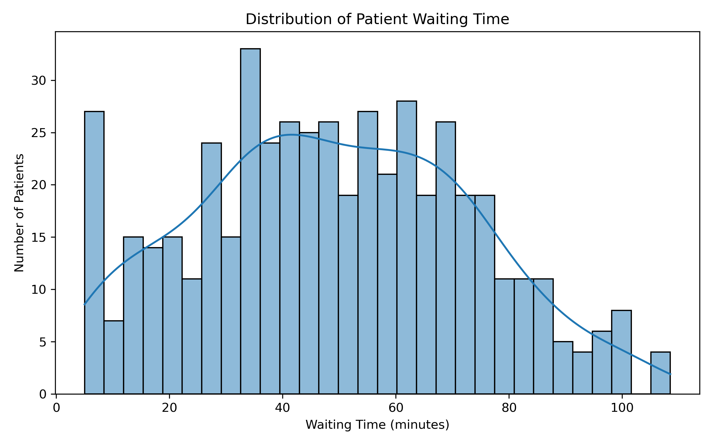

### Figure 2. Average Waiting Time by Department

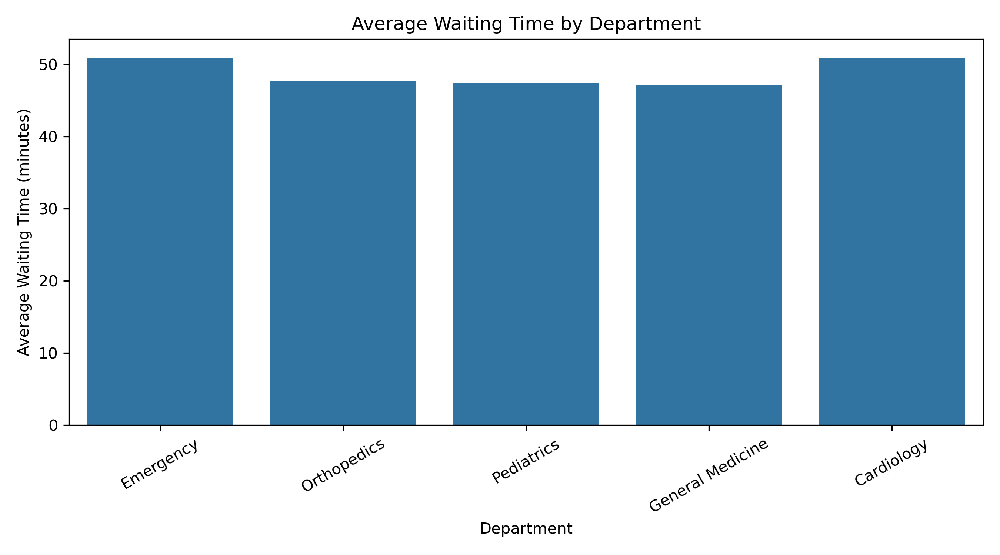

### Figure 3. Queue Length vs Waiting Time

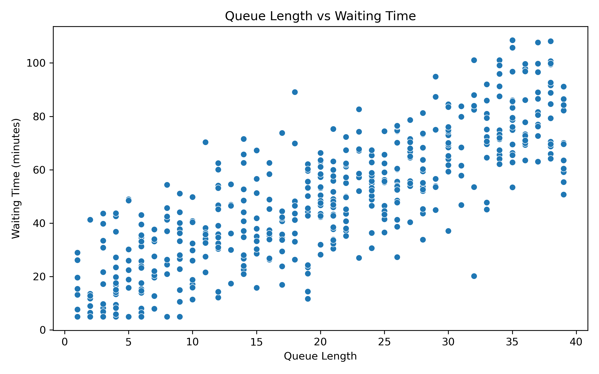

### Figure 4. Staff Available vs Waiting Time

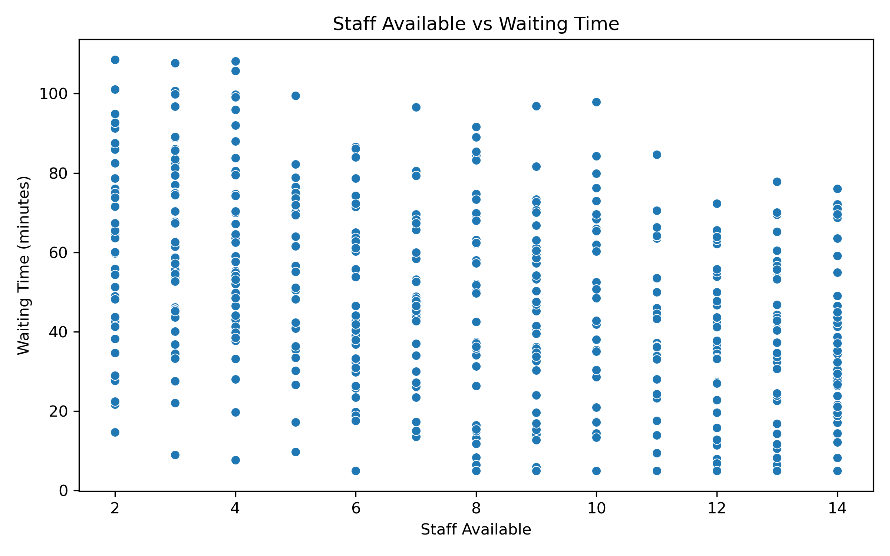

### Figure 5. Actual vs Predicted Waiting Time

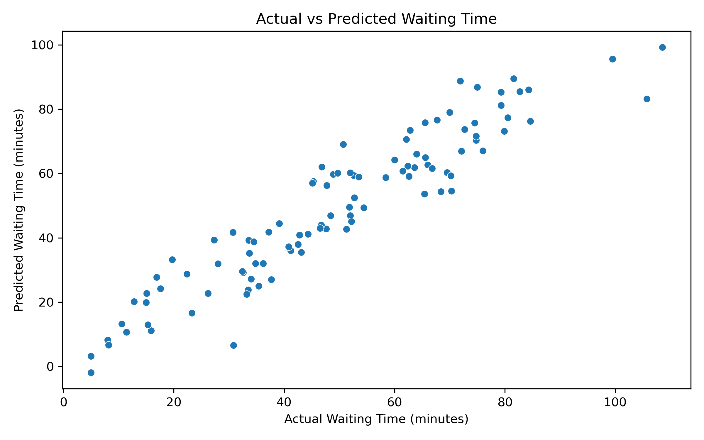

### Figure 6. Patient Clusters Based on Waiting Time Pattern

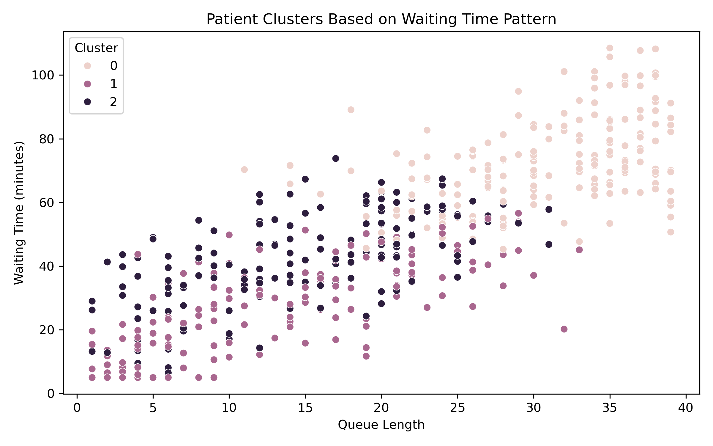

---

# Part B: Patient Risk Classification and Service Association Analysis

Part B focuses on classifying patient risk levels and discovering healthcare service usage patterns.

## Objectives

* To classify patients into Low, Medium, and High risk groups.
* To identify service association patterns.
* To support triage planning and healthcare resource allocation.

## Dataset

The Part B dataset contains **500 simulated patient records**. The main variables include:

* Patient profile information
* Department
* Admission type
* Chronic disease status
* Vital signs
* Service use indicators
* Risk level

The target variable is:

* **Risk_Level**

Risk_Level contains three classes:

* Low
* Medium
* High

## Methods Used

* Decision Tree Classification
* Association Rule Mining

## Main Files

* `KQC7016_PartB_patient_risk_analysis.py`
* `smart_hospital_partb_patient_risk_dataset.csv`
* `partb_decision_tree_metrics.csv`
* `partb_association_rules.csv`
* `partb_fig_confusion_matrix.png`
* `partb_fig_risk_by_department.png`
* `partb_fig_risk_distribution.png`
* `partb_fig_service_by_risk.png`
* `partb_fig_simplified_decision_tree.png`

## Main Results

The decision tree model achieved:

* **Accuracy = 74.4%**
* **Weighted precision = 73.5%**
* **Weighted recall = 74.4%**
* **Weighted F1-score = 73.5%**

The association rule mining results showed that high-risk patients were strongly linked with:

* Observation
* ECG
* Laboratory tests
* Hospital admission

## Part B Result Figures

### Figure 7. Patient Risk Level Distribution

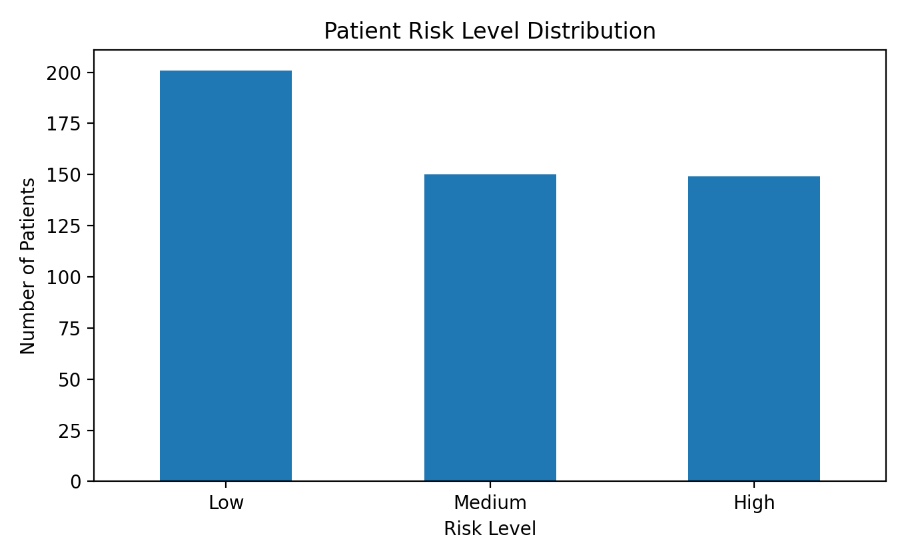

### Figure 8. Risk Level by Department

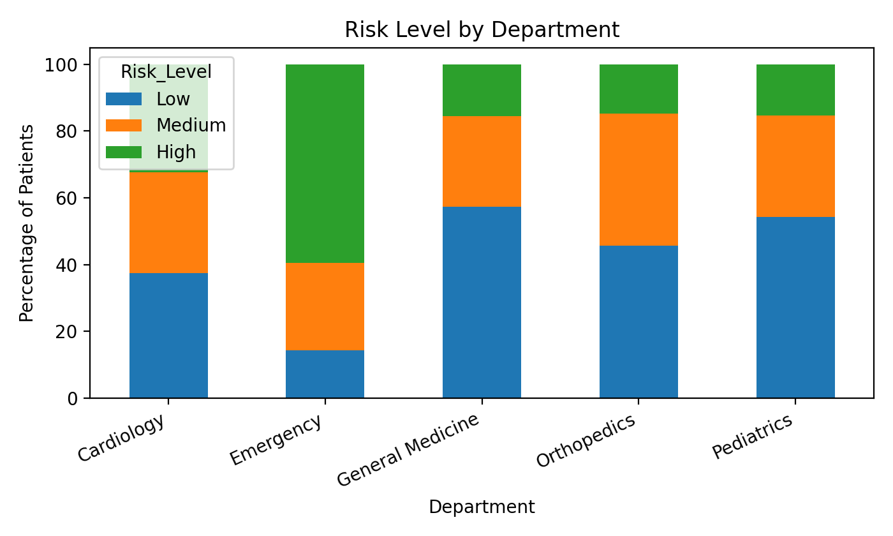

### Figure 9. Simplified Decision Tree Logic

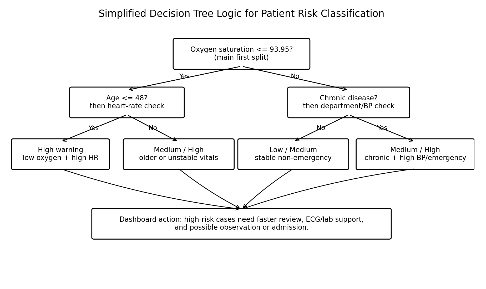

### Figure 10. Decision Tree Confusion Matrix

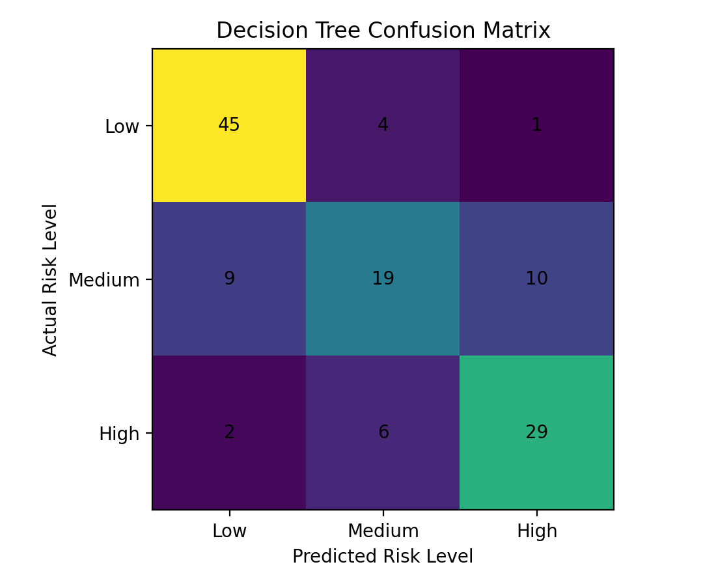

### Figure 11. Selected Service Use by Risk Level

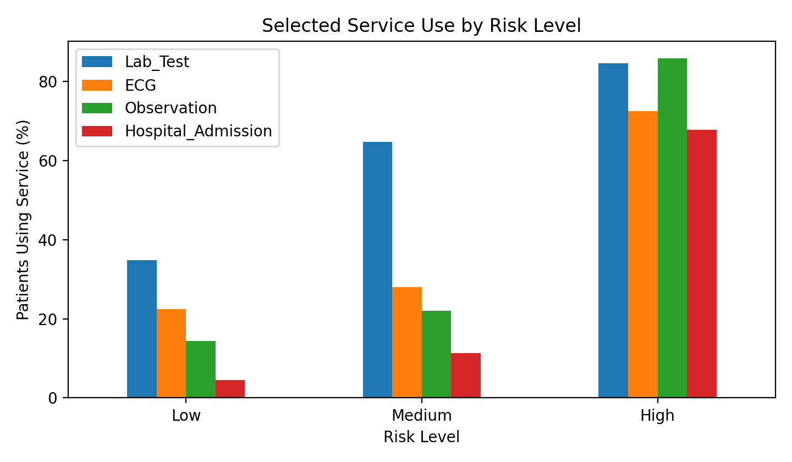

---

# Tools and Libraries Used

* Python
* Jupyter Notebook
* Pandas
* NumPy
* Matplotlib
* Seaborn
* Scikit-learn

---

# Summary

This project shows how simple data analytics methods can support smart hospital decision-making. Part A helps predict patient waiting time and detect congestion groups. Part B supports patient risk classification and service planning. Together, the two parts provide useful insights for queue control, triage support, and healthcare resource allocation.

The models are intended for academic analysis and decision-support purposes only. They should not replace clinical judgement. Future work should test the same pipeline using real hospital data with proper privacy protection.

